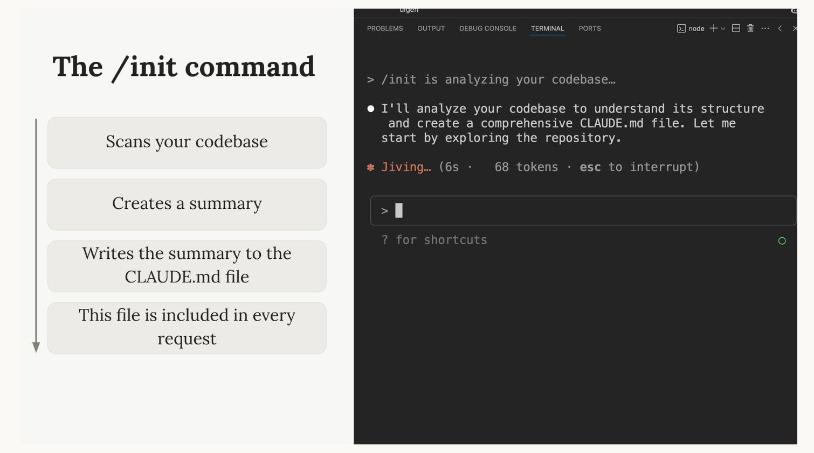
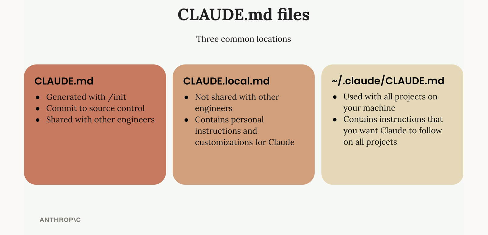

코딩 프로젝트에서 Claude와 함께 작업할 때, 컨텍스트 관리는 매우 중요합니다. 프로젝트에는 수십, 수백 개의 파일이 있을 수 있지만, Claude가 효과적으로 돕기 위해서는 올바른 정보만 필요합니다. 관련 없는 컨텍스트가 너무 많으면 오히려 Claude의 성능이 저하되므로, 관련 파일과 문서로 안내하는 방법을 배우는 것이 중요합니다.


### `/init` 명령어

새로운 프로젝트에서 Claude를 처음 시작할 때, `/init` 명령어를 실행하세요. 이 명령어는 Claude에게 전체 코드베이스를 분석하여 다음을 파악하도록 지시합니다:

  * 프로젝트의 목적과 아키텍처
  * 중요한 명령어와 핵심 파일
  * 코딩 패턴과 구조



코드를 분석한 후, Claude는 요약본을 생성하여 `CLAUDE.md` 파일에 작성합니다. Claude가 이 파일 생성을 위한 권한을 요청할 때, `Enter` 키를 눌러 각 쓰기 작업을 승인하거나, `Shift+Tab`을 눌러 세션 동안 Claude가 자유롭게 파일을 작성하도록 허용할 수 있습니다.

### `CLAUDE.md` 파일

`CLAUDE.md` 파일은 두 가지 주요 목적을 가집니다:

1.  중요한 명령어, 아키텍처, 코딩 스타일을 알려주며 Claude가 코드베이스를 파악하도록 안내합니다.
2.  Claude에게 구체적이거나 맞춤형 지시를 내릴 수 있게 해줍니다.

이 파일은 Claude에게 보내는 모든 요청에 포함되므로, 프로젝트를 위한 영구적인 시스템 프롬프트와 같은 역할을 합니다.

### `CLAUDE.md` 파일 위치

Claude는 세 가지 일반적인 위치에 있는 세 종류의 `CLAUDE.md` 파일을 인식합니다:

  * **`CLAUDE.md`**: `/init`으로 생성되며, 소스 컨트롤에 커밋되어 다른 엔지니어와 공유됩니다.
  * **`CLAUDE.local.md`**: 다른 엔지니어와 공유되지 않으며, Claude를 위한 개인적인 지시사항과 사용자 정의 설정을 담습니다.
  * **`~/.claude/CLAUDE.md`**: 사용자의 컴퓨터에 있는 모든 프로젝트에 사용되며, 모든 프로젝트에서 Claude가 따르기를 원하는 지시사항을 담습니다.





### 맞춤형 지시사항 추가하기

`CLAUDE.md` 파일에 지시사항을 추가하여 Claude의 행동 방식을 사용자 정의할 수 있습니다. 예를 들어, Claude가 코드에 주석을 너무 많이 추가한다면, 이 파일을 업데이트하여 문제를 해결할 수 있습니다.
`#` 명령어를 사용하여 "메모리 모드"로 진입하세요. 이를 통해 `CLAUDE.md` 파일을 지능적으로 편집할 수 있습니다. 다음과 같이 입력하기만 하면 됩니다:

```
# 주석은 꼭 필요할 때만 사용해. 복잡한 코드에만 주석을 달아줘.
```

Claude는 이 지시사항을 `CLAUDE.md` 파일에 자동으로 병합합니다.

### `@`를 이용한 파일 참조

Claude가 특정 파일을 보도록 해야 할 때, `@` 기호 뒤에 파일 경로를 붙여 사용하세요. 이렇게 하면 해당 파일의 내용이 Claude에게 보내는 요청에 자동으로 포함됩니다.
예를 들어, 인증 시스템에 대해 질문하고 싶고 관련 파일을 알고 있다면 다음과 같이 입력할 수 있습니다:

```
인증 시스템이 어떻게 작동해? @auth
```

그러면 Claude는 `auth` 관련 파일 목록을 보여주고, 사용자가 선택한 파일이 대화에 포함됩니다.

### `CLAUDE.md`에서 파일 참조하기

동일한 `@` 문법을 사용하여 `CLAUDE.md` 파일 내에서 직접 파일을 참조할 수도 있습니다. 이 기능은 프로젝트의 여러 측면과 관련된 파일에 특히 유용합니다.
예를 들어, 데이터 구조를 정의하는 데이터베이스 스키마 파일이 있다면, `CLAUDE.md`에 다음과 같이 추가할 수 있습니다:

```
데이터베이스 스키마는 @prisma/schema.prisma 파일에 정의되어 있어. 데이터베이스에 저장된 데이터의 구조를 이해해야 할 때는 언제든지 이 파일을 참조해.
```

이런 방식으로 파일을 참조하면, 해당 파일의 내용이 모든 요청에 자동으로 포함됩니다. 따라서 Claude는 매번 스키마 파일을 찾아서 읽을 필요 없이 데이터 구조에 대한 질문에 즉시 답할 수 있습니다.