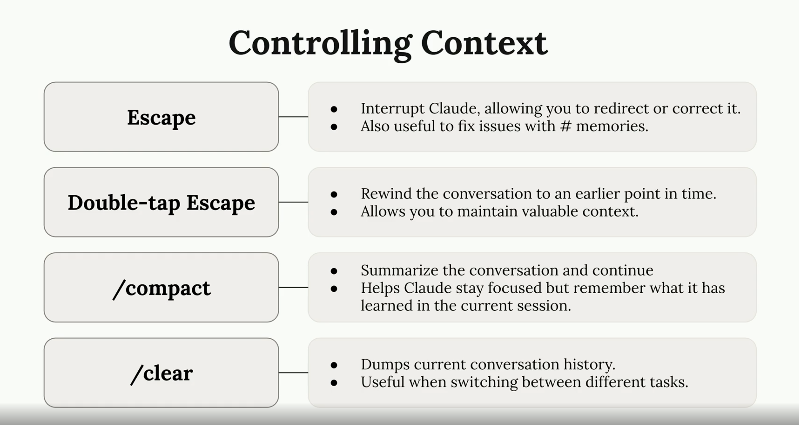

원문 : https://anthropic.skilljar.com/claude-code-in-action/303237

Claude와 복잡한 작업을 할 때, 대화를 집중적이고 생산적으로 유지하기 위해 대화를 유도해야 할 때가 많습니다. 대화의 흐름을 제어하고 Claude가 계속 집중하도록 돕는 데 사용할 수 있는 몇 가지 기술이 있습니다.

### `Escape` 키로 Claude 중단하기
때때로 Claude가 잘못된 방향으로 가거나 한 번에 너무 많은 것을 처리하려고 할 때가 있습니다. `Escape` 키를 눌러 Claude의 응답을 중간에 멈추고 대화의 방향을 바꿀 수 있습니다.

이 기능은 Claude가 여러 가지를 동시에 처리하는 대신 하나의 특정 작업에 집중하기를 원할 때 특히 유용합니다. 예를 들어, 여러 함수에 대한 테스트 작성을 요청했는데 Claude가 모든 함수에 대한 포괄적인 계획을 세우기 시작하면, 중단시키고 한 번에 하나의 함수에만 집중하도록 요청할 수 있습니다.

### `Escape`와 메모리 기능 결합하기
Escape 기술의 가장 강력한 응용 중 하나는 반복적인 오류를 수정하는 것입니다. Claude가 여러 대화에 걸쳐 동일한 실수를 반복할 때, 다음과 같이 할 수 있습니다:
1.  `Escape`를 눌러 현재 응답을 중단합니다.
2.  `#` 단축키를 사용하여 올바른 접근 방식에 대한 메모리를 추가합니다.
3.  수정된 정보로 대화를 계속합니다.

이렇게 하면 Claude가 프로젝트의 향후 대화에서 동일한 오류를 범하는 것을 방지할 수 있습니다.

### 대화 되감기
긴 대화를 하는 동안 관련이 없거나 방해가 되는 컨텍스트가 쌓일 수 있습니다. 예를 들어, Claude가 오류를 만나 디버깅하는 데 시간을 보냈다면, 그 오고 간 논의는 다음 작업에 유용하지 않을 수 있습니다.

`Escape` 키를 두 번 눌러 대화를 되감을 수 있습니다. 그러면 보냈던 모든 메시지가 표시되어, 이전 시점으로 돌아가 거기서부터 계속할 수 있습니다. 이 기술은 다음을 돕습니다:
* 가치 있는 컨텍스트(Claude의 코드베이스 이해 등)를 유지합니다.
* 방해가 되거나 관련 없는 대화 기록을 제거합니다.
* Claude가 현재 작업에 집중하도록 합니다.

### 컨텍스트 관리 명령어
Claude는 대화 컨텍스트를 효과적으로 관리하는 데 도움이 되는 여러 명령어를 제공합니다:

#### `/compact`
`/compact` 명령어는 Claude가 학습한 핵심 정보를 보존하면서 전체 대화 기록을 요약합니다. 다음과 같은 경우에 이상적입니다:
* Claude가 프로젝트에 대한 가치 있는 지식을 얻었을 때
* 관련된 작업을 계속하고 싶을 때
* 대화가 길어졌지만 중요한 컨텍테스트를 포함하고 있을 때

Claude가 현재 작업에 대해 많이 학습했고, 다음 관련 작업으로 넘어갈 때 그 지식을 유지하고 싶을 때 `compact`를 사용하세요.

#### `/clear`
`/clear` 명령어는 대화 기록을 완전히 제거하여 새롭게 시작할 수 있게 해줍니다. 다음과 같은 경우에 가장 유용합니다:
* 완전히 다르거나 관련 없는 작업으로 전환할 때
* 현재 대화 컨텍스트가 새 작업에 대해 Claude를 혼란스럽게 할 수 있을 때
* 이전 컨텍스트 없이 완전히 새로 시작하고 싶을 때

### 이 기술들을 언제 사용해야 할까?
이러한 대화 제어 기술은 다음과 같은 상황에서 특히 유용합니다:
* 컨텍스트가 복잡해질 수 있는 긴 대화
* 이전 컨텍스트가 방해가 될 수 있는 작업 전환 시점
* Claude가 반복적으로 같은 실수를 하는 상황
* 특정 구성 요소에 계속 집중해야 하는 복잡한 프로젝트

`Escape`, 이중 `Escape`, `/compact`, `/clear`를 전략적으로 사용함으로써 개발 워크플로우 전반에 걸쳐 Claude를 집중되고 생산적인 상태로 유지할 수 있습니다. 이것들은 단순한 편의 기능이 아니라, 효과적인 AI 지원 개발 세션을 유지하기 위한 필수 도구입니다.

